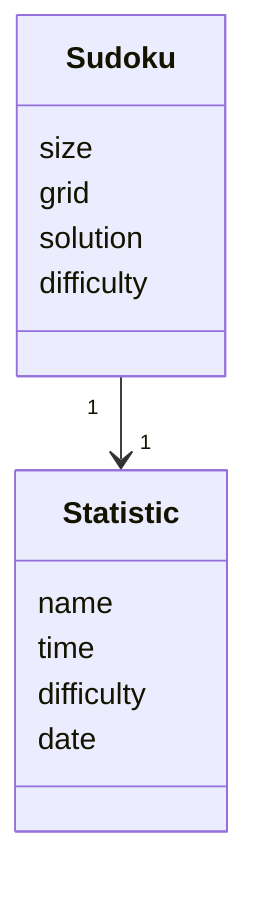
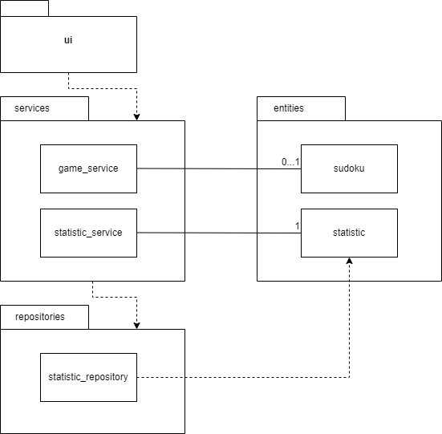
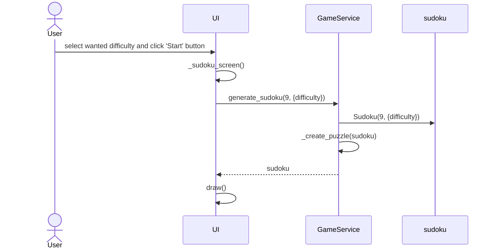

# Architectural description

## Structure

The structure of the program follows a three-tier architecture, and the packaging diagram of the code is as follows:

## User interface

The user interface contains the following main views:

- Pygame Game menu
- Pygame Gameplay window
- TKinter Statistics viewing

Each of these have been implemented in their own classes and only one view is visible at a time. Switching between the pygame windows is done by drawing new elements on the screen, while The [UIControl](../src/ui/ui.py) class is responsible for changing the view otherwise.

## Application logic

The logical data model of the application is made up of the classes [Sudoku](../src/entities/sudoku.py) and [Statistic](../src/entities/statistic.py), which describe the Sudoku puzzle and statistics of a completed sudoku:

The classes [GameService](../src/services/game_service.py) and [StatisticService](../src/services/statistic_service.py) are responsible for the application logic. The classes offer their own methods for functions of the user interface. These include, for example:

- `generate_sudoku(size, difficulty)`
- `create_statistic(name, time, difficulty, date)`
- `get_all_by_filter()`

The statistic service class uses [StatisticRepository](../src/repositories/statistic_repository.py) class to access the data. The repository is responsible for data storage and retrieval.

A class/packaging diagram describing the relationship between the service classes and other parts of the program:

## Permament data storage

The repository class `StatisticRepository` is responsible for storing the data. The class stores the data into an sqlite database.

The repository class follows the [Repository](https://en.wikipedia.org/wiki/Data_access_object) design pattern and can be replaced with new implementations if the data storage method of the application is changed.

## Main functions

### Starting a sudoku

Once the user has selected the wanted difficulty and pressed the start button, the sequence of events is as follows:

Once the user presses the start button, the screen changes into a loading screen while the UI calls on the application logic class GameService's method generate_sudoku, passing as arguments the size and difficulty of the sudoku. A new Sudoku entity is initialized, and using the _create_puzzle method, a  new sudoku puzzle is created and then returned to the UI. Using the Sudoku, the UI can now draw it onto the screen so the user can start playing.