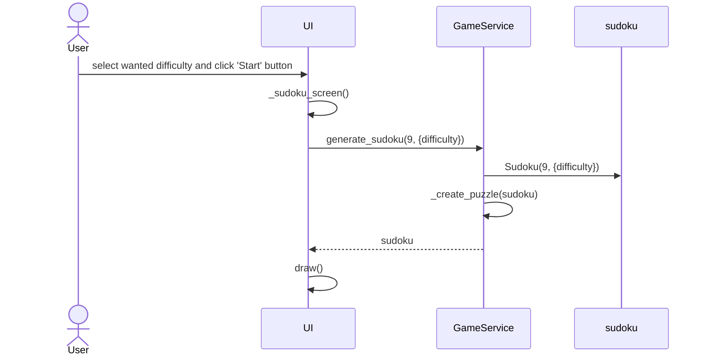

# Architectural description

## Structure

The structure of the program follows a three-tier architecture, and the class/packaging diagram of the code is as follows:

## Application Logic

### Starting a sudoku

Once the user has selected the wanted difficulty and pressed the start button, the sequence of events is as follows:

Once the user presses the start button, the screen changes into a loading screen while the UI calls on the application logic class GameService's method generate_sudoku, passing as arguments the size and difficulty of the sudoku. A new Sudoku entity is initialized, and using the _create_puzzle method, a  new sudoku puzzle is created and then returned to the UI. Using the Sudoku, the UI can now draw it onto the screen so the user can start playing.