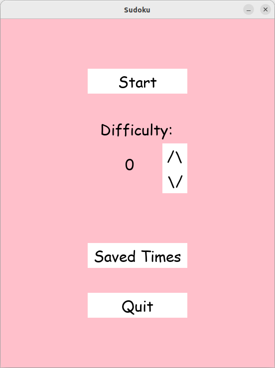
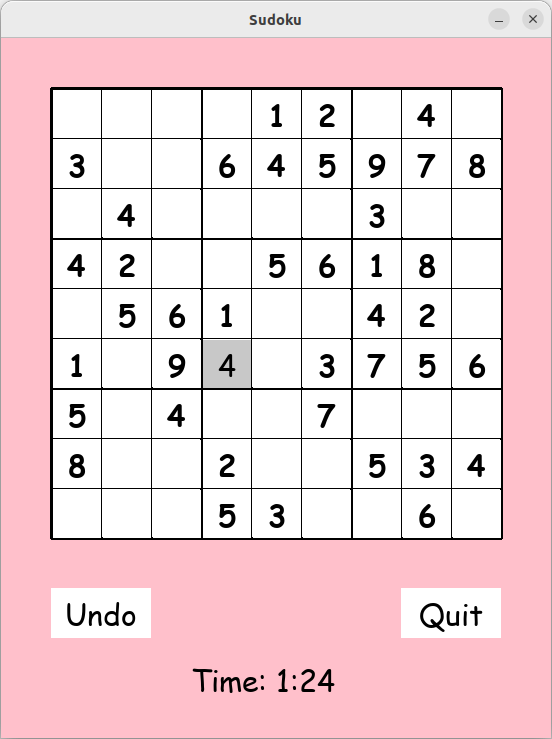
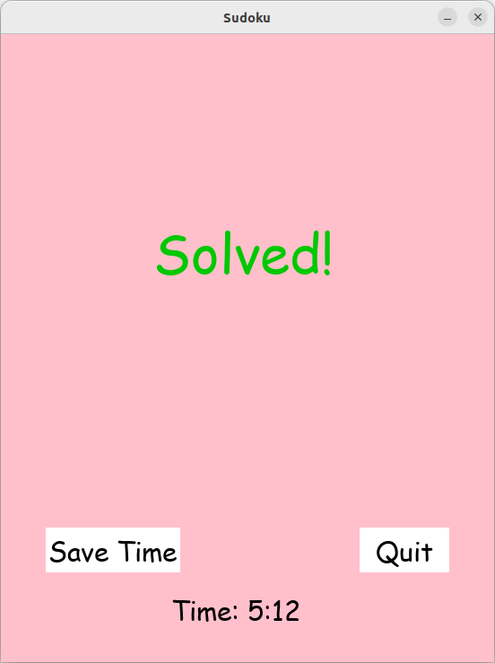
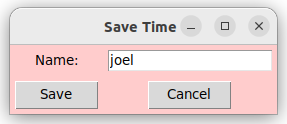
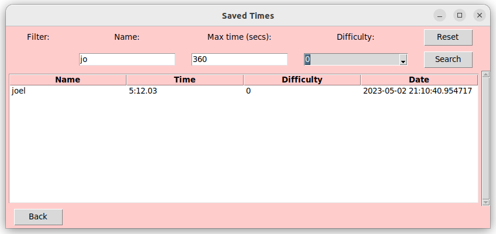

# User manual

Download the latest [release](https://github.com/Piketulus/ot-harjoitustyo/releases) of the project's source code by selecting _Source code_ from the _Assets_ section.

## Configuration

The names of the file used for saving data can be configured in the _.env_-file in the root directory of the project. The file is created automatically in the _data_-directory if it does not exist there already. The format of the file is as follows:

```
DATABASE_FILENAME=database.sqlite
```

## Starting the program

Before running the program, install the dependencies with the command:

```bash
poetry install
```

Now the program can be started with the command:

```
poetry run invoke start
```

## Start menu

The program starts with the start menu:



The start menu has the following buttons:
 - Start: Starts a sudoku game of the selected difficulty
 - "/\": increases the difficulty
 - "\/": decreases the difficulty
 - Saved times: Opens the saved times window
 - Quit: Quits the program

## Playing the game

After starting the game by pressing the start button, the sudoku board is shown:



A square on the board can be selected by clicking on it and by pressing the number keys 1-9, the number can be entered into the square. The number can be removed by pressing the backspace key. Placements and removals can be undone with undo button and the game can be quit with the quit button.

## Saving your time

Once the sudoku is correctly filled in, the time will stop and this window will appear:



The time can be saved by pressing the save button which will open the following window:



The time will be saved with the name entered into the text field. The name can be changed by editing the text field and the time can be saved by pressing the save button. The time can be discarded by pressing the cancel button.


## Viewing your times

After pressing the saved times button in the start menu, the following window will appear:



The times are shown in a table with the name, time, difficulty and date of each completed game. The times can be filtered using the given fields, which all work in combination, and then pressing the search button. Reset the filter with the reset button and go back to the start menu with the back button.