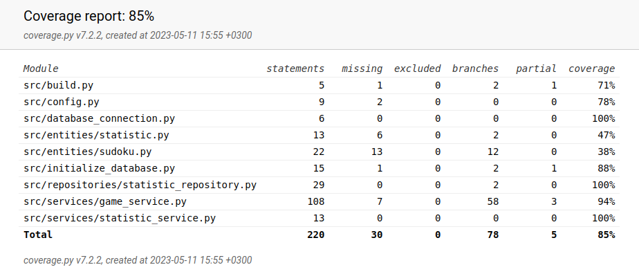

# Testing document

The program has been tested both with automated unit and integration tests with unittest and manually with system level tests.

## Unit and integration testing

### Application logic

The application logic classes `GameService`and `StatisticService` are tested with [GameServiceTest](../src/tests/services/game_service_test.py) and [StatisticServiceTest](../src/tests/services/statistic_service_test.py) test classes. The `GameService` and `StatisticService` objects are initialized with repository objects that save data to a new and empty testing database (not the same one used for the application).

### Repository classes

The repository class `StatisticsRepository` is tested with [TestStatisticsRepository](../src/tests/repositories/statistics_repository_test.py) test class. The `StatisticsRepository` object is initialized with a repository object that saves data to a new and empty testing database (not the same one used for the application).

### Test coverage

The test coverage of the application is 85% excluding the user interface layer.

## System testing

The system testing of the application has been done manually.

### Installation and configuration

The application has been downloaded and tested as described in the [user manual](./kayttoohje.md) in a Linux environment. The application has also been tested with different configurations through the _.env_ file.

### Functionality

All the functionalities listed in the [specification document](./vaatimusmaarittely.md#basic-functionality) and the user manual have been tested.

## Quality issues in the application

The application does not give sensible error messages in the following situations:

- The SQLite database has not been initialized, i.e. `poetry run invoke build` command has not been executed