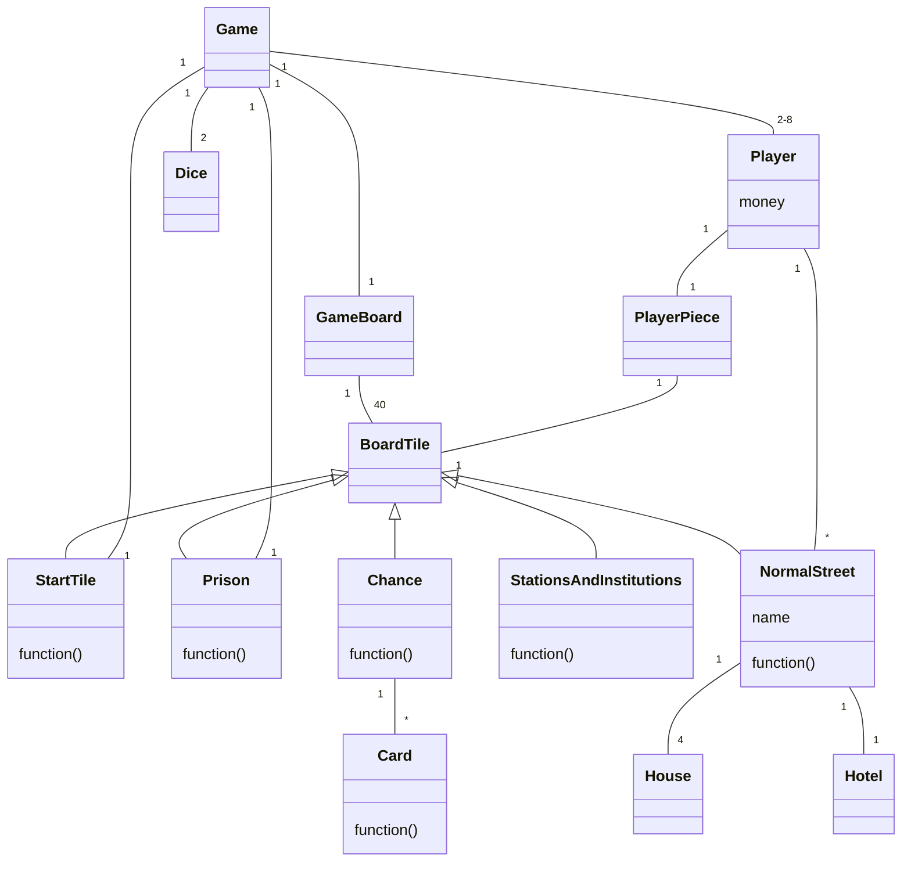

```mermaid
 classDiagram
      Game "1" -- "2-8" Player
      Game "1" -- "2" Dice
      Game "1" -- "1" GameBoard
      Player "1" -- "1" PlayerPiece
      GameBoard "1" -- "40" BoardTile
      PlayerPiece "1" -- "1" BoardTile
      BoardTile <|-- StartTile
      BoardTile <|-- Prison
      BoardTile <|-- Chance
      BoardTile <|-- StationsAndInstitutions
      BoardTile <|-- NormalStreet
      Game "1" -- "1" StartTile
      Game "1" -- "1" Prison
      Chance "1" -- "*" Card
      NormalStreet "1" -- "4" House
      NormalStreet "1" -- "1" Hotel
      Player "1" -- "*" NormalStreet
      
      
      class Game{
      }
      class Dice{
      }
      class Player{
        money
      }
      class PlayerPiece{
      }
      class GameBoard{
      }
      class BoardTile{
      }
      class StartTile{
        function()
      }
      class Prison{
        function()
      }
      class Chance{
        function()
      }
      class StationsAndInstitutions{
        function()
      }
      class NormalStreet{
        name
        function()
      }
      class Card{
        function()
      }
      class Hotel{
      }
      class House{
      }
```
