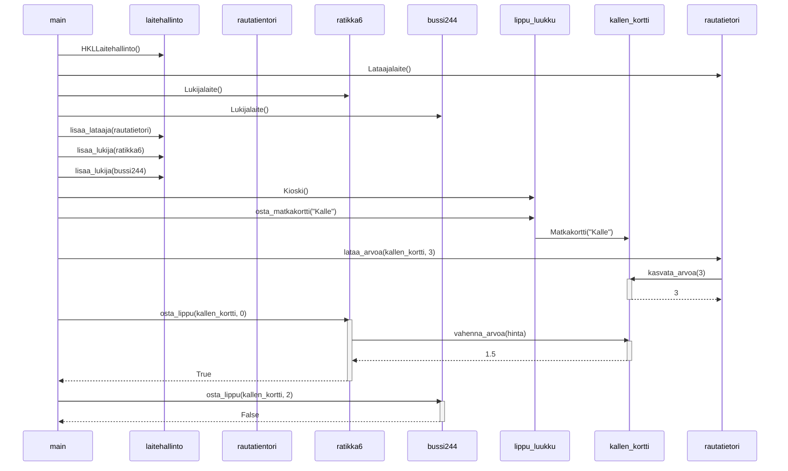

```mermaid

  sequenceDiagram
  participant main
  participant laitehallinto
  participant rautatientori
  participant ratikka6
  participant bussi244
  participant lippu_luukku 
  participant kallen_kortti
  
  main->>laitehallinto: HKLLaitehallinto()
  main->>rautatietori: Lataajalaite()
  main->>ratikka6: Lukijalaite()
  main->>bussi244: Lukijalaite()
  
  main->>laitehallinto:lisaa_lataaja(rautatietori)
  main->>laitehallinto: lisaa_lukija(ratikka6)
  main->>laitehallinto: lisaa_lukija(bussi244)
  
  main->>lippu_luukku: Kioski()
  main->>lippu_luukku: osta_matkakortti("Kalle")
  lippu_luukku->>kallen_kortti: Matkakortti("Kalle")
  
  main->>rautatietori: lataa_arvoa(kallen_kortti, 3)
  rautatietori->>kallen_kortti: kasvata_arvoa(3)
  activate kallen_kortti
  kallen_kortti-->>rautatietori: 3
  deactivate kallen_kortti
  
  main->>ratikka6: osta_lippu(kallen_kortti, 0)
  activate ratikka6
  ratikka6->>kallen_kortti: vahenna_arvoa(hinta)
  activate kallen_kortti
  kallen_kortti-->>ratikka6: 1.5
  deactivate kallen_kortti
  ratikka6-->>main: True
  deactivate ratikka6
  
  main->>bussi244: osta_lippu(kallen_kortti, 2)
  activate bussi244
  bussi244-->>main: False
  deactivate bussi244
  
  
```
